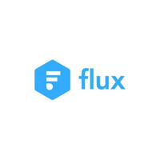
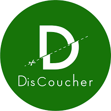
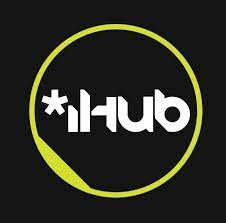

 

  

    
  

  

    <h3 class="text-2xl">Software Engineer</h3>
    <small class="text-xs block text-gray-700">BoostedChat</small>
    <small class="text-xs block text-gray-700 mb-4">September 2024 – September 2025</small>
  

 

In BoostedChat I worked on automating lead generation and engagement on social media using LLMs.

* Oversaw the Instagram connection service using the MQTT protocol — adding new functionalities, ensuring secure connections, and persistent listening.
* Built and maintained the **React frontend dashboard** for data input, analysis, and reporting via a Django API.
* Designed and implemented features for the **Django backend**.
* Worked with the data team to build an **AI-driven insights engine** using Crew AI and GPT models.
* Developed and maintained the **CI/CD pipeline** with GitHub Actions and Docker for deployments to **GCP** and **Contabo**.
* Improved daily outreach performance from 5 to 30 contacts through backend optimization.

---

 

  

    
  

  

    <h3 class="text-2xl">Software Engineer</h3>
    <small class="text-xs block text-gray-700">Inflowkit · Full-time</small>
    <small class="text-xs block text-gray-700 mb-4">Mar 2020 – January 2025</small>
  

 

Inflowkit is a Shopify plugin enabling merchants to sell digital content.

* Designed and implemented backend features in **Rails** and corresponding UI in **React**.
* Scaled the user base from **70 to 1,000+ merchants** by introducing a recurrent payment feature.
* Dealt with performance and scaling challenges: code optimization, faster data retrieval, and infrastructure upgrades.
* Built an **admin analytics dashboard** in React to visualize usage metrics for marketing decisions.
* Wrote **RSpec request tests** and **Cypress feature tests**.
* Managed **AWS** staging and production environments.
* Participated in product demos, customer support, and marketing decisions.

---

  

  

  <h3 class="text-2xl">Software Engineer</h3>
  <small class="text-xs block text-gray-700">Herufi · Part-time</small>
  <small class="text-xs block text-gray-700 mb-4">Jan 2019 – Present</small>
  

 

A side project that provides financial solutions for church communities to digitize tithe and offering contributions.

* Developing **Rails APIs** and **Flutter mobile interfaces** integrating M-Pesa Mobile Money.
* Building Vue front-end for data interaction & analysis.
* Writing **RSpec request and feature tests**.

---

  

  

  <h3 class="text-2xl">Co-owner, Full Stack Engineer</h3>
  <small class="text-xs block text-gray-700">Flux (Distro) · start up · Self-Employed</small>
  <small class="text-xs block text-gray-700 mb-4">2018 – 2020</small>
  

 

Built a system to enable field teams to track tasks, collect data, and generate reports for water utility companies.

* Designed and implemented the **Distro web app** (Rails backend + Angular frontend).
* Built a **Flutter mobile app** for field teams with offline-first capabilities for low-connectivity areas.
* Led requirement gathering, system design, testing, and deployment.

---

  

    

  

  <h3 class="text-2xl">Full stack Software Engineer</h3>
  <small class="text-xs block text-gray-700">Discoucher · start up</small>
  <small class="text-xs block text-gray-700 mb-4">February 2018 – July 2019</small>
  

 

Part-time project that helped users discover restaurants and hotels while boosting visibility for hospitality businesses.

* Built a full system powered by a **Rails backend** with:
    * A management dashboard for business analytics
    * Customer-facing **Flutter apps** for Android and iOS
    * A business app for real-time purchase management
* Deployed and monitored the system to ensure **99.9% uptime** while continuously adding new features.

---

  

  
 
  <h3 class="text-2xl">Co-founder · Full stack Software Engineer</h3>
  <small class="text-xs block text-gray-700">Darasa · start up</small>
  <small class="text-xs block text-gray-700 mb-4">September 2015 – July 2016</small>
  

 

Co-founded a mobile revision app helping university students prepare for exams using a question–answer format.

* Conducted user interviews, prototype testing, and pilot deployment.
* Developed **Rails APIs** and implemented M-Pesa mobile payments.
* Built an automation bot for importing thousands of questions and answers.

---

  

  

  <h3 class="text-2xl">Assistant community manager</h3>
  <small class="text-xs block text-gray-700">Ihub</small>
  <small class="text-xs block text-gray-700 mb-4">anuary – August 2015</small>
  

Nairobi’s Innovation Hub for technologists and startups.

* Supported the developer community through partnerships and mentorship.
* Matched skilled members to project opportunities and organized startup-focused events.
* Promoted iHub’s mission and its contribution to Kenya’s tech ecosystem.

---

## **Hobbies**

Hanging out with family · Tech DIY projects · Reading & writing poetry · Exploring nature

---
